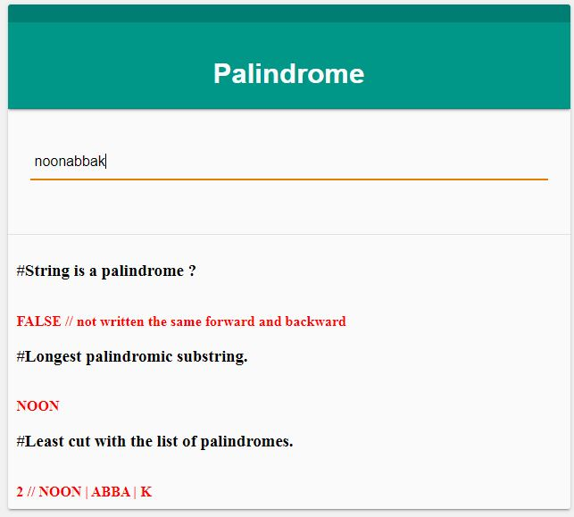

# Zigzag-Gengo-Solutions-Engineer-Test

### Description ###
"Palindrome Challenge" is ann app that process the given string and returns certain results.

### Web Technologies ###
* HTML
* CSS
* jQuery version 3.4.1
* PHP version 5.3 or greater

### Functionality ###
* Checks if the given string is a Palindrome
* Returns Longest palindromic substring
* returns minimum cut that makes all the string palindrome

### Setup ###

This guide assumes you used window server and  have text editor , git, apache web server and PHP5<PHP7 installed.

- WAMP Server : https://sourceforge.net/projects/wampserver
- XAMPP Server: https://www.apachefriends.org/download.html
- Sublime Text: https://www.sublimetext.com/3

- GIT         : https://git-scm.com/downloads

1. Get source code using git

```
$ git clone https://github.com/kirin2/Zigzag-Gengo-Solutions-Engineer-Test.git
```

2. Add in your windows Host file.Replace with the correct location depending on your setup.
* {Your local drive}\Windows\System32\drivers\etc\host

```
127.0.0.1 local.palindrome
```

3. Add apache vhost. Replace with the correct location depending on your setup.

* {Your local drive}\{Your Apache Folder}\conf\extra\httpd-vhosts.conf
```
<VirtualHost *:80>

	ServerName local.palindrome
	ServerAlias local.palindrome
	
	DocumentRoot "{Your local drive}\Zigzag-Gengo-Solutions-Engineer-Test"
	
	DirectoryIndex index.php index.htm index.html
	
	<Directory "{Your local drive}\Zigzag-Gengo-Solutions-Engineer-Test">
		Options -Indexes FollowSymLinks
		AllowOverride All
		Order allow,deny
		Allow from all
	</Directory>
	
</VirtualHost>
```
4. Restart your apache services

5. Open you favorite browser and go to <a href="http://local.palindrome">local.palindrome</a>

###  Screenshot ###




